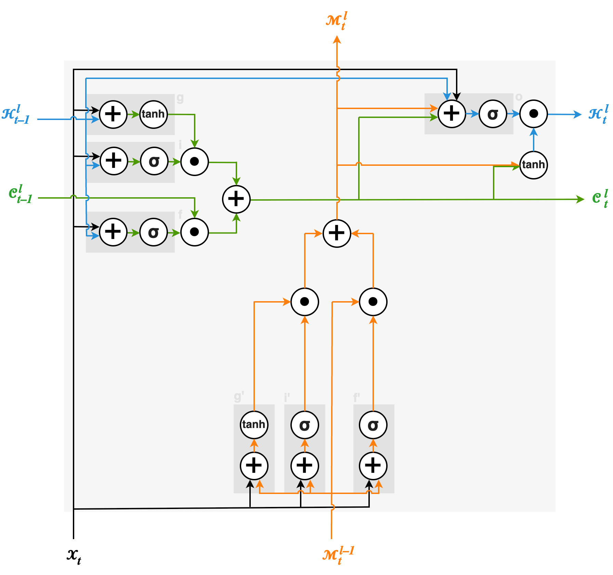
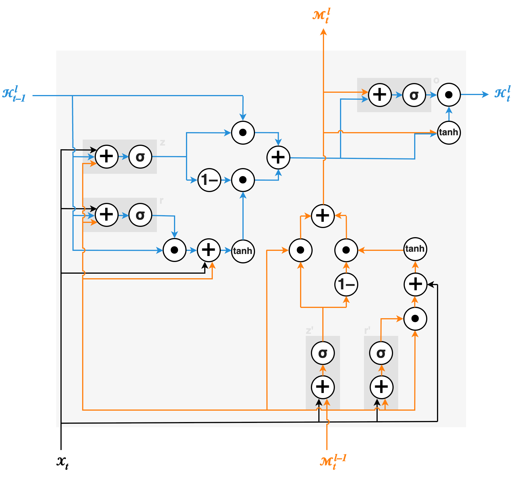
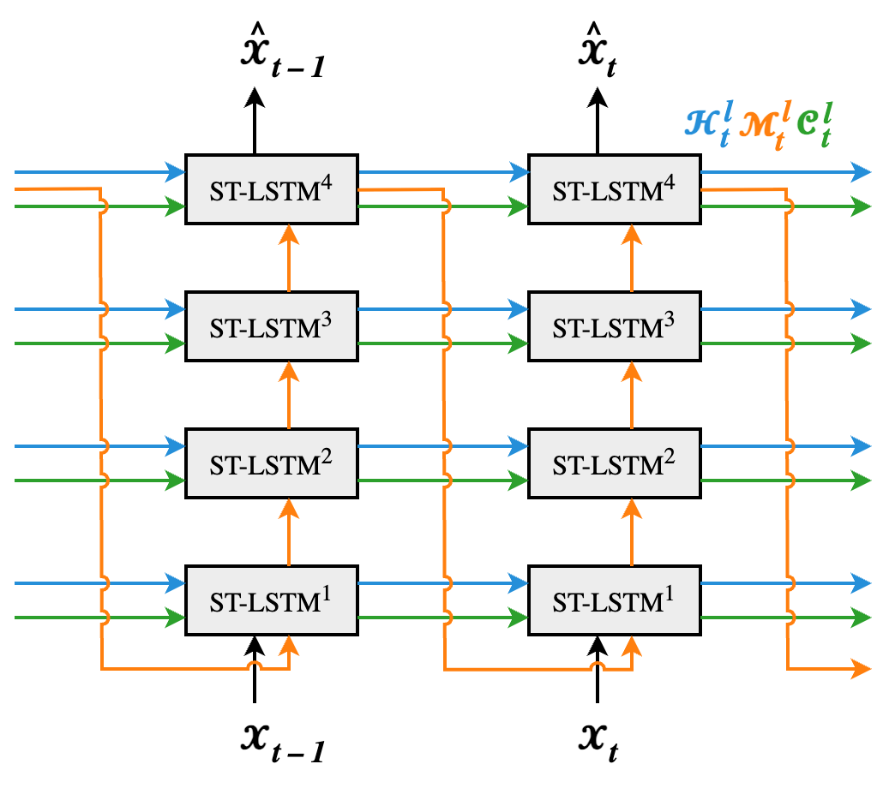
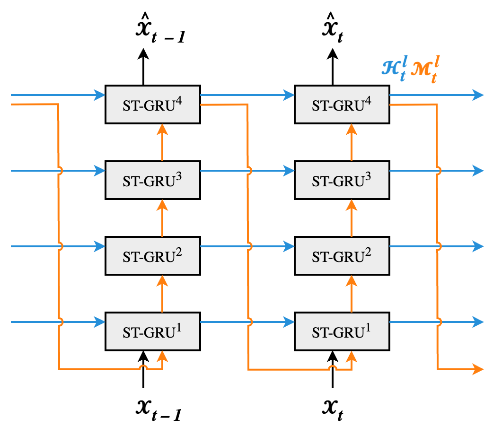

# ST-GRU PredRNN: A GRU-Based Reformulation of PredRNN for Video Prediction

This repository contains our implementation of a **Spatiotemporal GRU (ST-GRU)** variant of **PredRNN-V2**.

The goal of this work is to investigate whether the original **Spatiotemporal LSTM (ST-LSTM)** building blocks of PredRNN can be replaced by a simpler **Spatiotemporal GRU (ST-GRU)** while maintaining competitive video prediction performance.

To test this hyhpothesis, our experiments focus on the **Moving MNIST** benchmark.

The metovitation, methods and results are thoroughly described in the attached [report](https://github.com/xPatta/ST-GRU/STGRU_predRNN_v2.pdf).

## Project Overview

**PredRNN-V2** [[paper](https://arxiv.org/pdf/2103.09504.pdf)] achieves state-of-the-art video prediction through a dual-memory Spatiotemporal LSTM (ST-LSTM), which models both temporal and spatial dynamics, and a reverse scheduled sampling that forces to model to learn long term dynamics.

In this project we redesign the recurrent cell by replacing every ST-LSTM in the predRNN-V2 architecture, with a novel **ST-GRU** cell. Inspired by the standard GRU, and adapting it to account for spatio-temporal features, similarly to what has been done with the ST-LSTM cell, ST-GRU:

- replaces the multiple LSTM gates with GRU update and reset gates,
- removes the explicit temporal memory cell by integrating it into the hidden state,
- retains the spatiotemporal memory flow used by PredRNN,
- aims to reduce architectural complexity and computational cost.

The remainder of the PredRNN-V2 framework, including reverse scheduled sampling, is preserved.

<p align="center">
  
  
</p>

<p align="center">
  
  
</p>


## Motivation

While LSTM-based architectures provide strong long-term memory capabilities, they introduce a relatively large number of parameters and computational overhead.

GRUs are known to:

- require fewer parameters,
- converge faster during training,
- require less memory,
- often achieve comparable performance on sequential tasks.

This project explores whether these advantages transfer to spatiotemporal predictive learning.

## Experimental Setup

We evaluate the proposed ST-GRU PredRNN-V2 using the **Moving MNIST** dataset.

The model is trained following the original PredRNN-V2 experimental protocol:

- Dataset: Moving MNIST
- Training iterations: 80,000
- Prediction task: future frame prediction
- Evaluation metrics:
  - Mean Squared Error (MSE)
  - Structural Similarity Index (SSIM)
  - Learned Perceptual Image Patch Similarity (LPIPS)
  - Peak Signal-to-Noise Ratio (PSNR)

## Results

Our ST-GRU implementation successfully learns the spatiotemporal dynamics of Moving MNIST and produces realistic future frame predictions.

Compared to existing methods:

| Model | MSE ↓ | SSIM ↑ | LPIPS ↓ | PSNR ↑ |
|------|------:|------:|------:|------:|
| ConvLSTM | 103.3 | 0.707 | 0.156 | - |
| PredRNN (ST-LSTM) | 56.8 | 0.867 | 0.107 | - |
| PredRNN-V2 (ST-LSTM) | **48.4** | **0.891** | 0.071 | **20.047** |
| ConvGRU | 57.8 | 0.839 | 0.091 | - |
| ST-GRU PredRNN | **53.4** | **0.893** | **0.057** | - |
| **Our ST-GRU PredRNN-V2** | **55.1** | **0.883** | **0.065** | **19.529** |

Overall, our model achieves performance comparable to the original PredRNN while using a simplified recurrent architecture. Although the original PredRNN-V2 generally remains the strongest performer, the proposed ST-GRU demonstrates that a lighter recurrent design can preserve much of the predictive capability.

## Repository Structure

```
core/
    ST-GRU implementation
    model definition
    training utilities

moving-mnist-data/
    train set
    test set
    validation set

mnist_script/
    training scripts

results/
    generated predictions
```


## Getting Started

### Requirements

- Python 3.6+
- PyTorch 1.9 (or compatible)

Install dependencies:

```bash
pip install -r requirements.txt
```

---

## Dataset

Download the **Moving MNIST** dataset and place it in the expected data directory.

---

## Training

Train the ST-GRU model using

```bash
cd mnist_script
sh train.sh
```

(or the corresponding training script included in this repository).

Model checkpoints are saved to the configured checkpoint directory.

---

## Evaluation

Run evaluation using

```bash
cd mnist_script
sh test.sh
```

Generated predictions and evaluation metrics will be saved automatically.

---

## Key Contributions

- Implementation of a novel **Spatiotemporal GRU (ST-GRU)** cell.
- Replacement of PredRNN's ST-LSTM blocks with ST-GRU blocks.
- Experimental comparison against PredRNN, PredRNN-V2, ConvLSTM and ConvGRU.
- Evaluation on the Moving MNIST benchmark.

---

## Conclusion

This work demonstrates that replacing PredRNN's ST-LSTM with a simpler ST-GRU architecture is feasible while maintaining competitive prediction quality. Although the original PredRNN-V2 still achieves the strongest overall performance, the proposed model provides a promising direction for reducing architectural complexity in spatiotemporal recurrent networks.

---

## Acknowledgements

This project is based on the original PredRNN and PredRNN-V2 implementations:

- Wang et al., *PredRNN: Recurrent Neural Networks for Predictive Learning Using Spatiotemporal LSTMs*, NeurIPS 2017.
- Wang et al., *PredRNN: A Recurrent Neural Network for Spatiotemporal Predictive Learning*, TPAMI 2022.

This repository contains a modified implementation developed for educational and research purposes.

---

## Citation

If you use this implementation, please cite both the original PredRNN papers and acknowledge this ST-GRU adaptation where appropriate.